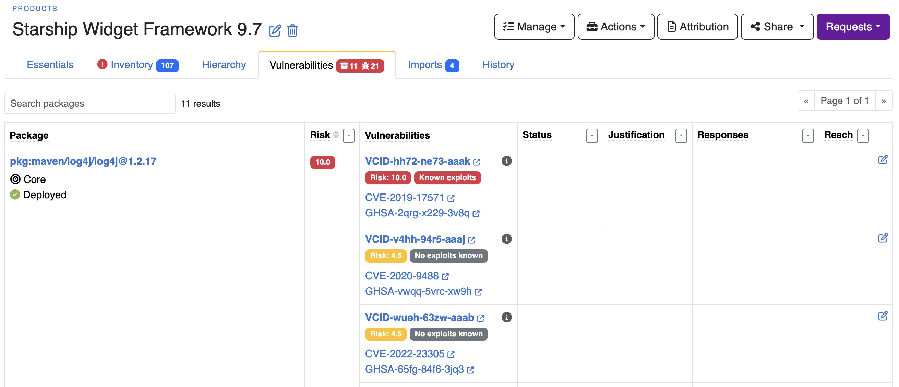
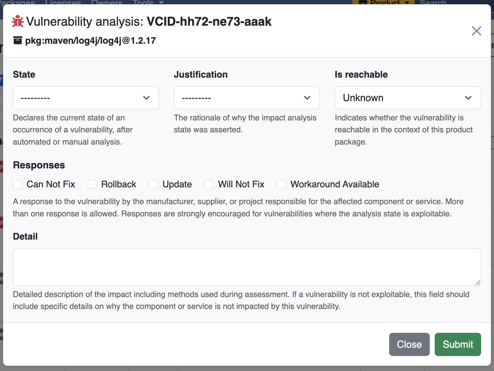
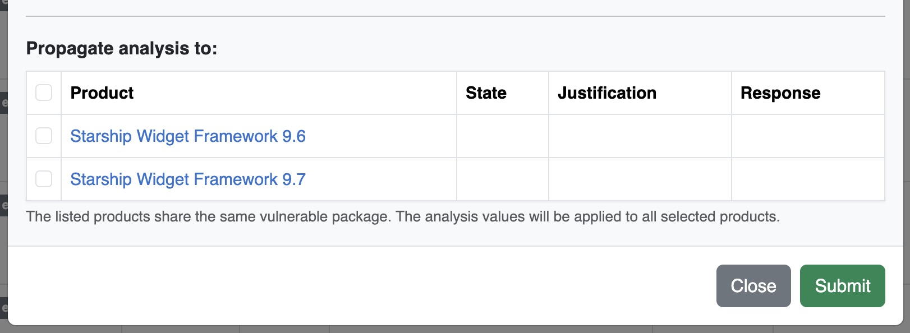

.. _how_to_4:

How To 4 - Product Vulnerability Analysis
=========================================

This chapter provides a step-by-step guide to analyzing and managing vulnerabilities
specific to a Product using DejaCode’s integrated tools and features.

Overview
--------

Product Vulnerability Analysis in DejaCode helps teams assess, review, and manage
vulnerabilities specific to individual Products. The platform supports detailed
analysis workflows, data propagation across related products, and integration with
external tools via the **REST API**.

1. Accessing Product Vulnerability Analysis
-------------------------------------------

To begin analyzing vulnerabilities for a Product:

1. Navigate to the **Products** section from the main menu.
2. Select a specific Product from the list to open the **Product Details** page.
3. Click on the :guilabel:`Vulnerabilities` tab to view all vulnerabilities affecting
   the Product.

- The tab lists vulnerabilities associated with all packages linked to the Product.
- Use filters and sorting options to prioritize specific vulnerabilities based on
  criteria such as **risk score**, **exploitability**, **severity**, or
  **exploitability**.

  .. image:: images/howto-4-product-vulnerability-analysis/vulnerability-row.jpg

2. Reviewing Vulnerabilities
----------------------------

The Product :guilabel:`Vulnerabilities` tab provides a detailed row for each
vulnerability, enabling in-depth review and understanding of its potential impact.

Each entry includes the following information:

- **Vulnerability ID**:
  A unique identifier prefixed with "VCID-", such as **VCID-2024-0001**, ensuring
  traceability.
- **Aliases**:
  Alternate identifiers for the vulnerability, including **CVE identifiers**
  (e.g., **CVE-2019-17571**).
- **Severity Levels**:
  Categorized as **critical**, **high**, **medium**, or **low**, based on potential
  impact.
- **Exploitability Score**:
  Indicates the likelihood of exploitation, with three levels:

  - **0.5**: No known exploits.
  - **1.0**: Potential exploits exist.
  - **2.0**: Known exploits are available.

- **Risk Score**:
  A value between **0.0** and **10.0**, representing the overall risk posed by the
  vulnerability.
  This score is calculated by multiplying the highest severity with its weight and
  the exploitability score, capped at **10.0**.
- **Affected Packages**:
  Links to the affected packages and their versions.

.. note::
   All vulnerability details, including analysis results and propagation status, are
   accessible through the **REST API**, enabling automated workflows and seamless
   integration with external tools.

3. Conducting Analysis
----------------------

DejaCode enables teams to conduct a thorough analysis of each vulnerability:

- Open the :guilabel:`Vulnerabilities` tab in the Product view.
- Use the **"Edit Analysis"** link on the right side of each row to open the
  **"Vulnerability Analysis"** form.

The analysis form provides the following fields for review and decision-making:

- **State**:
  Represents the current status of the vulnerability based on analysis. Options include:

  - **Resolved**: The vulnerability has been addressed.
  - **Resolved with Pedigree**: The vulnerability is resolved but requires specific
    conditions or lineage to verify resolution.
  - **Exploitable**: The vulnerability remains exploitable in its current state.
  - **In Triage**: The vulnerability is under evaluation and no decision has been made
    yet.
  - **False Positive**: The vulnerability was incorrectly flagged and is not a valid
    issue.
  - **Not Affected**: The vulnerability does not impact the component.

- **Justification**:
  Documents the rationale for the selected **State**. Choices include:

  - **Code Not Present**: The affected code does not exist in the component.
  - **Code Not Reachable**: The vulnerable code cannot be accessed or executed.
  - **Protected at Perimeter**: External defenses, such as firewalls, prevent
    exploitation.
  - **Protected at Runtime**: Runtime protections (e.g., sandboxing) mitigate the risk.
  - **Protected by Compiler**: Compiler-level protections are in place to block
    exploitation.
  - **Protected by Mitigating Control**: Additional controls render the vulnerability
    moot.
  - **Requires Configuration**: Exploitation is only possible under specific
    configurations.
  - **Requires Dependency**: Exploitation depends on an external dependency.
  - **Requires Environment**: The vulnerability can only be exploited in specific
    environments.

- **Responses**:
  Indicates the actions taken or planned by the manufacturer, supplier, or team
  responsible for the component. Multiple responses can be selected:

  - **Cannot Fix**: The vulnerability cannot be addressed.
  - **Rollback**: The affected component has been rolled back to a secure version.
  - **Update**: A patch or update has been applied to resolve the vulnerability.
  - **Will Not Fix**: The vulnerability will not be addressed, often due to low risk or
    impracticality.
  - **Workaround Available**: A workaround is provided to mitigate the impact of the
    vulnerability.

- **Detail**:
  A free-form text field for adding additional context or observations.
  Use this field to:

  - Describe the methods and tools used during analysis.
  - Provide reasons why a vulnerability is not exploitable (if applicable).
  - Document any assumptions, configurations, or steps taken to reach a conclusion.

.. note::
   The analysis details that you provide for a product package vulnerability are
   included in the "vulnerabilities" sections of CycloneDX VEX, SBOM+VEX, and CSAF
   documents when you share them from your products.

Performing an Analysis
^^^^^^^^^^^^^^^^^^^^^^

To analyze a vulnerability effectively:

1. **Access the Analysis Form**:
   Navigate to the Product :guilabel:`Vulnerabilities` tab and click **Edit Analysis**
   for the vulnerability.
2. **Set the State**:
   Choose the appropriate state that reflects the vulnerability's current status.
3. **Add Justification**:
   Select a justification that supports your analysis of the state.
4. **Specify Responses**:
   If applicable, document actions taken or planned in response to the vulnerability.
5. **Provide Details**:
   Use the detail field to add thorough notes about the assessment process and findings.
6. **Save Changes**:
   Save your analysis to ensure it is available for reference and propagated as needed.

.. note::
   The analysis data is also accessible via the **REST API**, making it possible to
   integrate with automated tools and workflows.

4. Propagating Analysis Across Products
---------------------------------------

To streamline reviews, DejaCode supports analysis data propagation:

- Analysis result is assigned to a vulnerability can be
  **propagated to other Products** that include the same affected packages.
- This feature ensures consistency across related products and reduces repetitive
  analysis efforts.

5. Leveraging REST API for Automation
-------------------------------------

The **REST API** provides full access to vulnerability analysis data, enabling
programmatic workflows such as:

- Querying vulnerabilities linked to specific Products.
- Automating analysis result updates.

Refer to the **API documentation** from the **"Tools" menu** for detailed guidance on
using these endpoints.

.. seealso::
   Explore the :ref:`reference_vulnerability_management` chapter for an overview of
   related features.

