.. _how_to_5:

How To 5 - Product Object Permissions
=====================================

As a DejaCode superuser you can view and edit all the Products in your Dataspace.
This chapter explains how to set the Object Permissions on a Product to make it
visible to other users who are not superusers. You can assign permissions by individual
user(s) or by permission group(s) or both.

1. Go to DejaCode Product Administration
----------------------------------------

To begin setting Object Permissions for a Product:

From the DejaCode Home page, use the right-hand dropdown menu and select **Products**
to go to Product Administration.

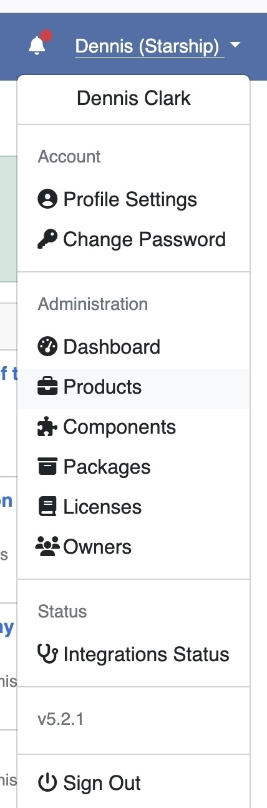

On the **Browse Products** form, filter and sort the list to find the Version of
the Product that you want to manage. Open that Product by clicking on its Name
or Version.

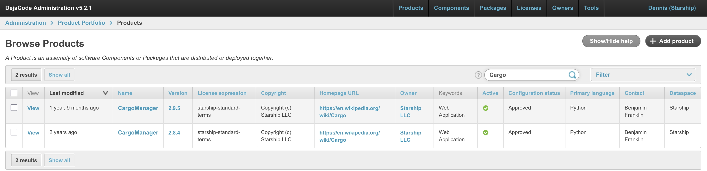

On the **Change Product** form, click the **Object permissions** button in the
upper-right-hand corner of the form.

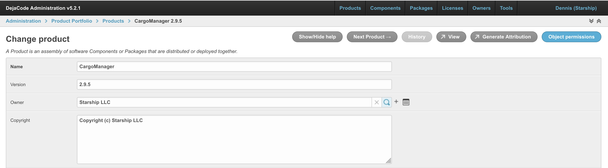

2. Set Product Object Permissions by DejaCode User
--------------------------------------------------

Note that the DejaCode User who originally created the Product is already in the
**Users** table.

Select a DejaCode User from the User dropdown list.

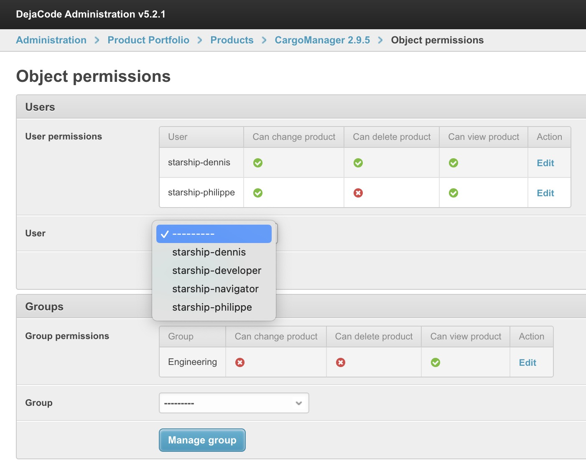

Click the **Manage User** button.

Double-click each Available Permission to be assigned to that User. Alternatively,
you can select an Available Permission and click the right-pointing arrow.

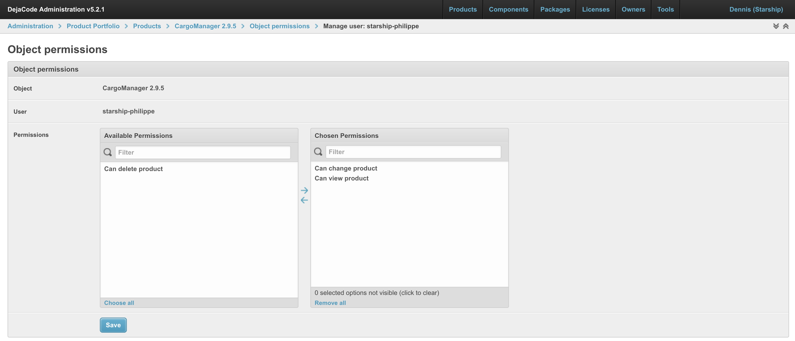

Click the **Save** button to commit your choices. Click the **Object permissions**
"breadcrumb" to return to that form.

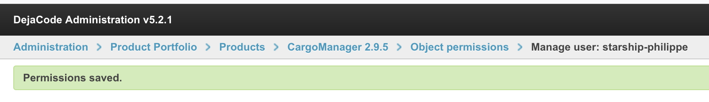

Note that the **Users** table presents the updated User permissions, and that you
can click on **Edit** to revise User permissions.

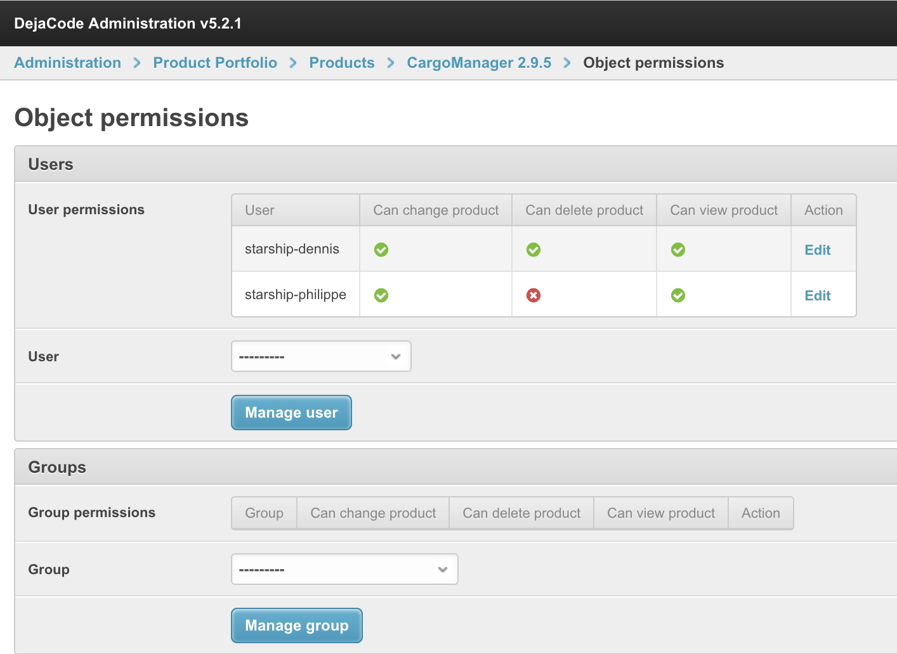

3. Set Product Object Permissions by Group
------------------------------------------

Note that you can set permissions by User or Group or both.

Select a Group from the Group dropdown list.

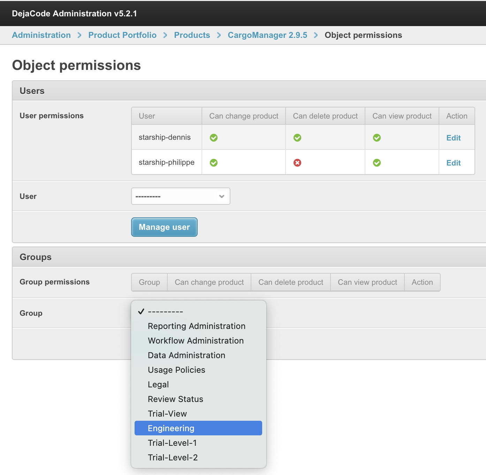

Click the **Manage Group** button.

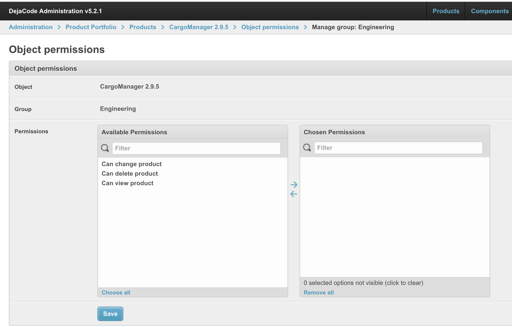

Double-click each Available Permission to be assigned to that Group. Alternatively,
you can select an Available Permission and click the right-pointing arrow.

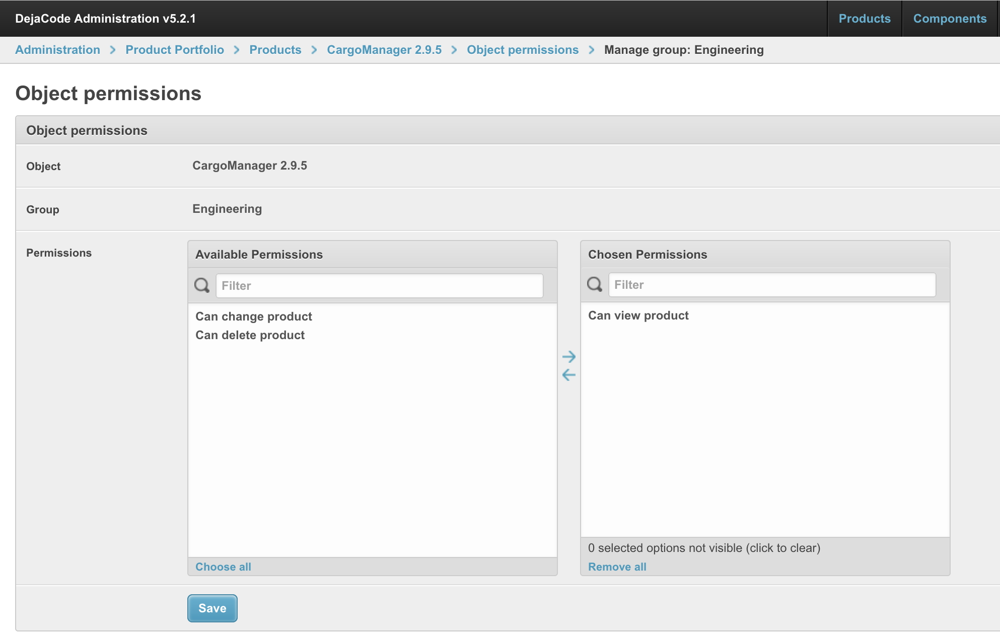

Click the **Save** button to commit your choices. Click the **Object permissions**
"breadcrumb" to return to that form.

Note that the **Groups** table presents the updated Group permissions, and that you
can click on **Edit** to revise Group permissions.

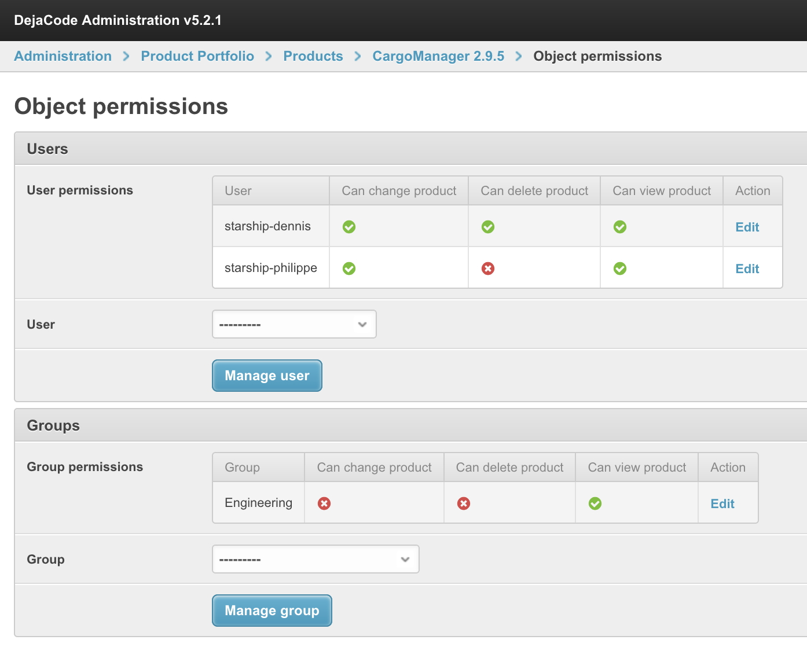

Also please note that the permission choices presented in this chapter are simply
examples and not recommendations.

You have now made the Product visible, and optionally editable, by DejaCode Users
that are not superusers.
