.. _how_to_5:

How To 5 - Product Object Permissions
=====================================

As a DejaCode superuser you can view and edit all the Products in your Dataspace.
This chapter explains how to set the Object Permissions on a Product to make it
visible to other users who are not superusers. You can assign permissions by individual
user(s) or by permission group(s) or both.

1. Go to DejaCode Product Administration
----------------------------------------

To begin setting Object Permissions for a Product:

From the DejaCode Home page, use the right-hand dropdown menu and select **Products**
to go to Product Administration.

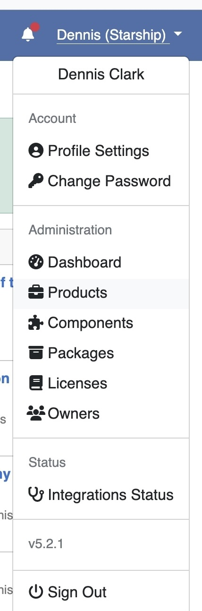

On the **Browse Products** form, filter and sort the list to find the Version of
the Product that you want to manage. Open that Product by clicking on its Name
or Version.

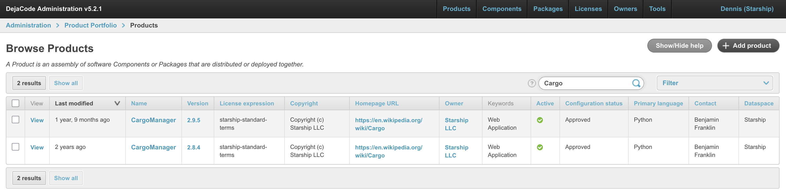

On the **Change Product** form, click the **Object permissions** button in the
upper-right-hand corner of the form.

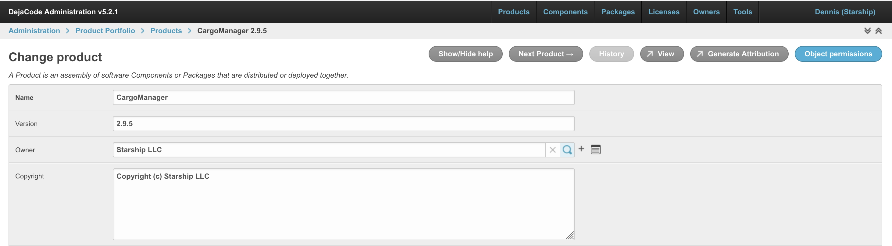

2. Set Product Object Permissions by DejaCode User
--------------------------------------------------

Note that the DejaCode User who originally created the Product is already in the
**Users** table.

Select a DejaCode User from the User dropdown list.

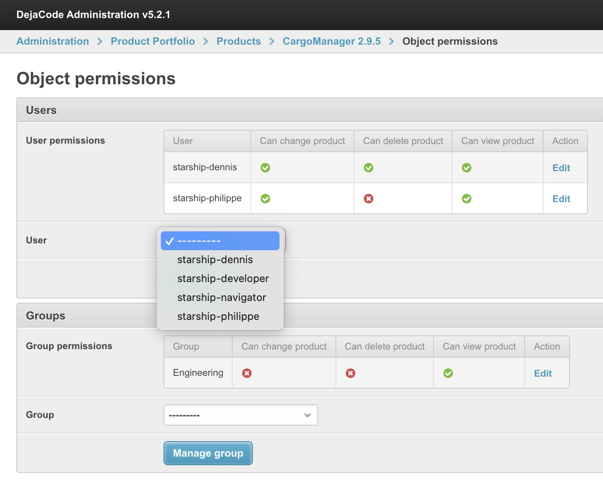

Click the **Manage User** button.

Double-click each Available Permission to be assigned to that User. Alternatively,
you can select an Available Permission and click the right-pointing arrow.

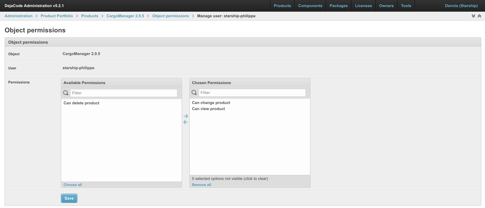

Click the **Save** button to commit your choices. Click the **Object permissions**
"breadcrumb" to return to that form.

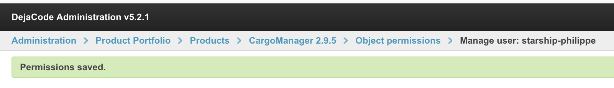

Note that the **Users** table presents the updated User permissions, and that you
can click on **Edit** to revise User permissions.

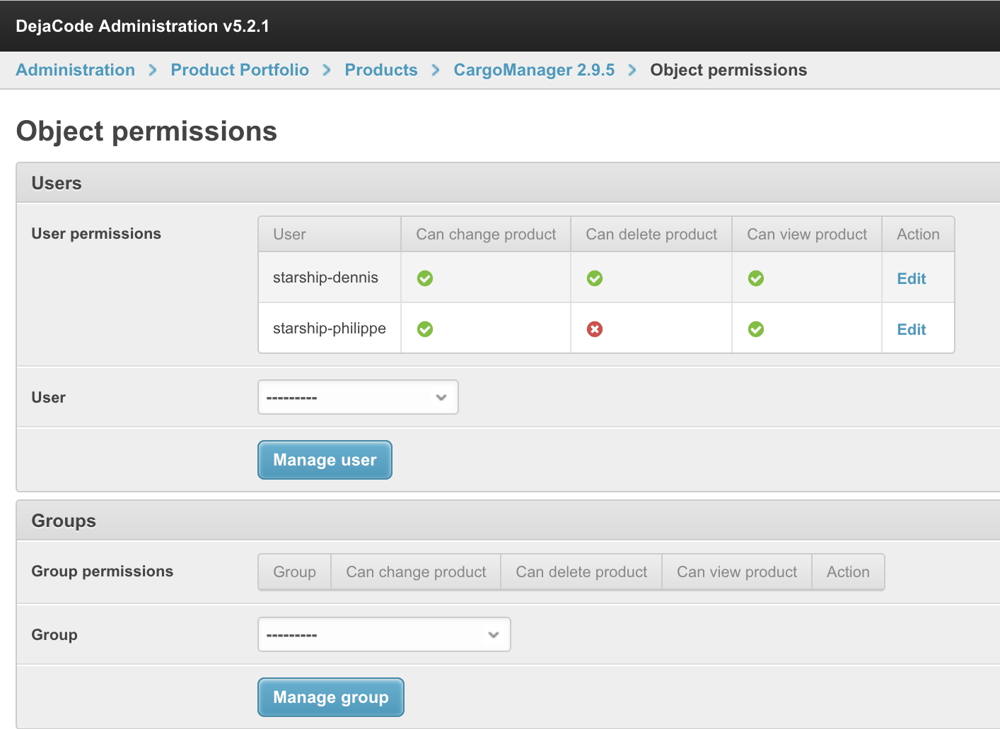

3. Set Product Object Permissions by Group
------------------------------------------

Note that you can set permissions by User or Group or both.

Select a Group from the Group dropdown list.

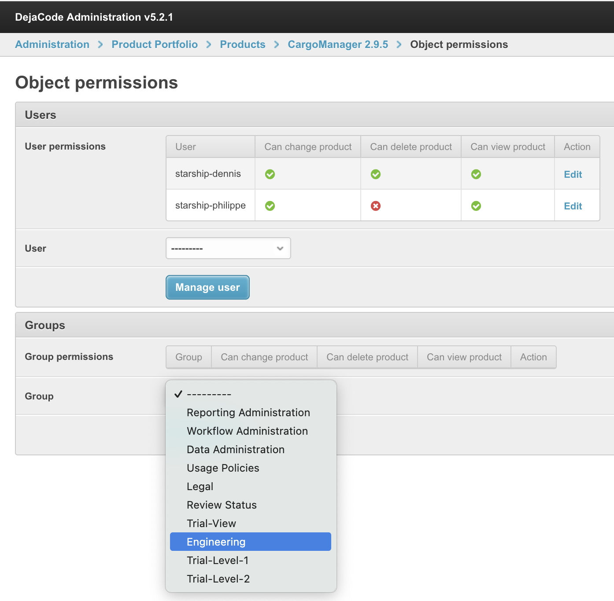

Click the **Manage Group** button.

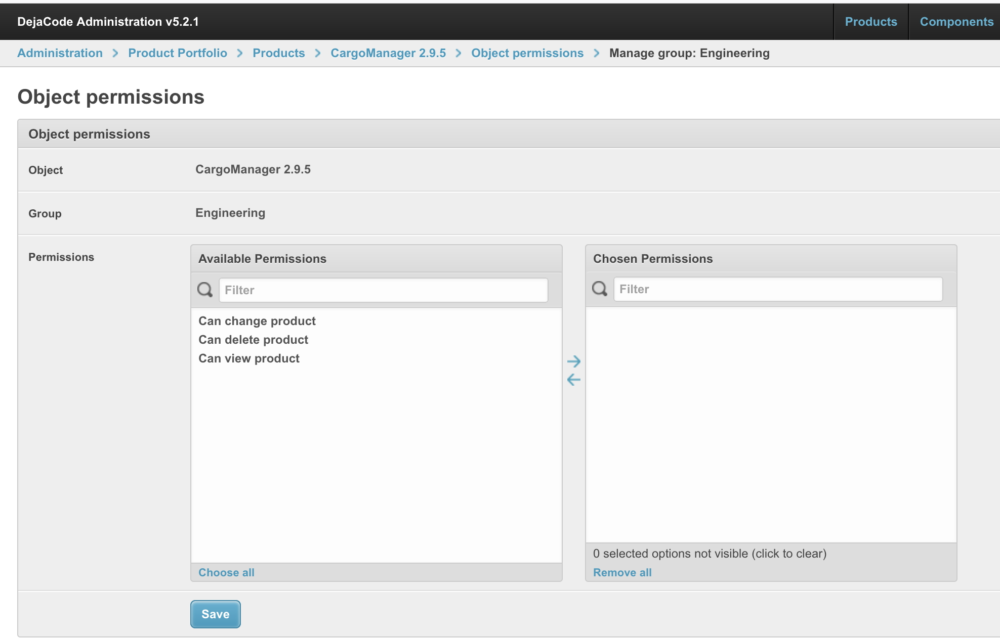

Double-click each Available Permission to be assigned to that Group. Alternatively,
you can select an Available Permission and click the right-pointing arrow.

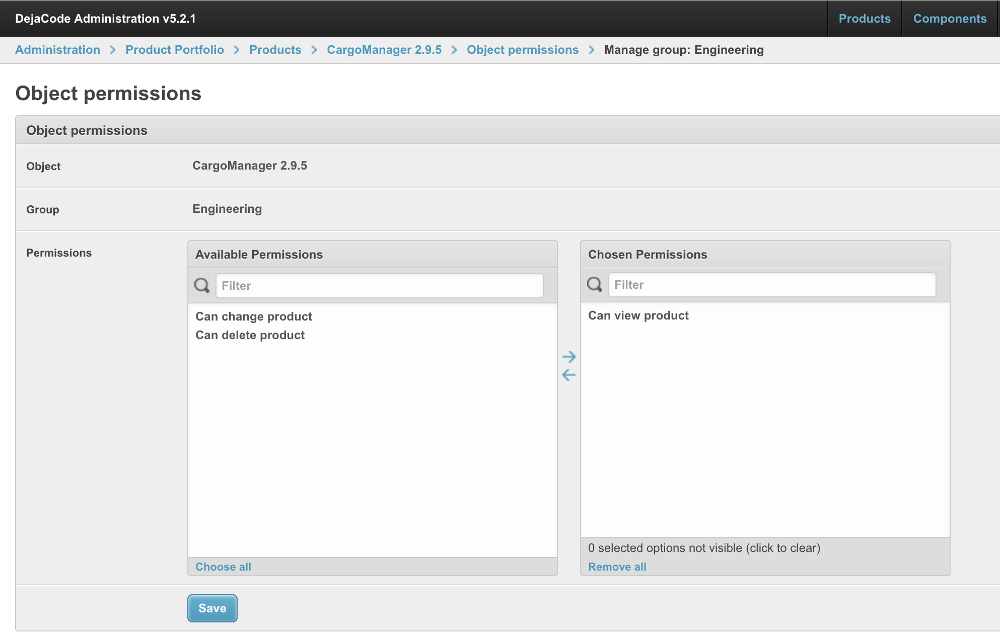

Click the **Save** button to commit your choices. Click the **Object permissions**
"breadcrumb" to return to that form.

Note that the **Groups** table presents the updated Group permissions, and that you
can click on **Edit** to revise Group permissions.

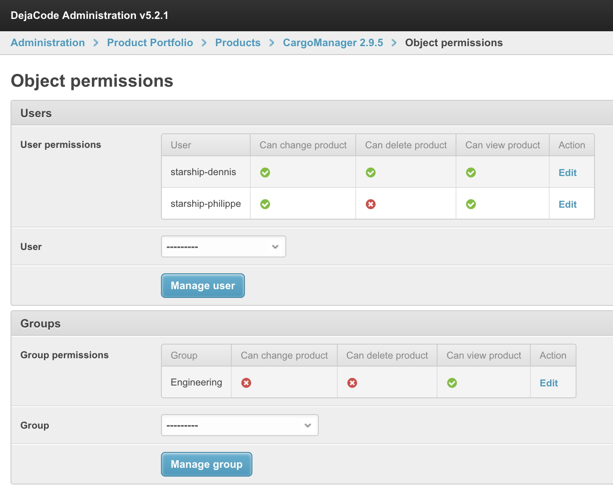

Also please note that the permission choices presented in this chapter are simply
examples and not recommendations.

You have now made the Product visible, and optionally editable, by DejaCode Users
that are not superusers.

4. Manage Product Object Permissions via the REST API
-----------------------------------------------------

Product object permissions can also be managed programmatically through the REST API.
This is especially useful for CI/CD pipelines that create Product versions automatically
and need to assign permissions without manual intervention.

The endpoint is available at::

    /api/v2/products/{uuid}/permissions/

**Authentication**

All requests require authentication. The examples below use an API key passed via
the ``Authorization`` header::

    Authorization: Token <your-api-token>

**Available permissions**

The following permission codenames can be assigned to users or groups:

- ``view_product`` -- allows viewing the product
- ``change_product`` -- allows editing the product
- ``delete_product`` -- allows deleting the product

**Finding the Product UUID**

Retrieve the UUID from the product list endpoint::

    GET /api/v2/products/?name=MyApp&version=2.0

The ``uuid`` field is included in each product entry of the response.

4.1 List current permissions
^^^^^^^^^^^^^^^^^^^^^^^^^^^^^

Retrieve all users and groups that currently have permissions on a product::

    GET /api/v2/products/{uuid}/permissions/

Response::

    {
        "users": [
            {
                "dataspace": "nexB",
                "username": "alice",
                "object_permissions": ["view_product", "change_product"]
            }
        ],
        "groups": [
            {
                "name": "backend-team",
                "object_permissions": ["view_product"]
            }
        ]
    }

4.2 Assign permissions to a user
^^^^^^^^^^^^^^^^^^^^^^^^^^^^^^^^^^

Provide ``user`` (username) and a ``permissions`` list::

    POST /api/v2/products/{uuid}/permissions/
    Content-Type: application/json

    {
        "user": "alice",
        "permissions": ["view_product", "change_product"]
    }

Successful response::

    {"status": "permissions assigned"}

4.3 Assign permissions to a group
^^^^^^^^^^^^^^^^^^^^^^^^^^^^^^^^^^^

Use ``group`` (group name) instead of ``user``. All members of the group will
inherit the assigned permissions::

    POST /api/v2/products/{uuid}/permissions/
    Content-Type: application/json

    {
        "group": "backend-team",
        "permissions": ["view_product"]
    }

This is the recommended approach when multiple users need access to the same set
of products. Manage group membership via the DejaCode admin, then assign the group
to each product once.

4.4 Remove permissions from a user or group
^^^^^^^^^^^^^^^^^^^^^^^^^^^^^^^^^^^^^^^^^^^^^

Use the ``DELETE`` method with the same body format::

    DELETE /api/v2/products/{uuid}/permissions/
    Content-Type: application/json

    {
        "user": "alice",
        "permissions": ["change_product"]
    }

Or for a group::

    DELETE /api/v2/products/{uuid}/permissions/
    Content-Type: application/json

    {
        "group": "backend-team",
        "permissions": ["view_product"]
    }

Successful response::

    {"status": "permissions removed"}

4.5 Automate permissions in a CI/CD pipeline
^^^^^^^^^^^^^^^^^^^^^^^^^^^^^^^^^^^^^^^^^^^^^

The following shell script illustrates how to create a Product version and immediately
assign permissions to a group, so that team members can view it without any manual
step::

    BASE_URL="https://dejacode.example.com/api/v2"
    TOKEN="your-api-token"
    GROUP="backend-team"

    # Create the product version
    RESPONSE=$(curl -s -X POST "$BASE_URL/products/" \
        -H "Authorization: Token $TOKEN" \
        -H "Content-Type: application/json" \
        -d '{"name": "MyApp", "version": "3.0"}')

    UUID=$(echo "$RESPONSE" | python3 -c "import sys,json; print(json.load(sys.stdin)['uuid'])")

    # Assign view permission to the team
    curl -s -X POST "$BASE_URL/products/$UUID/permissions/" \
        -H "Authorization: Token $TOKEN" \
        -H "Content-Type: application/json" \
        -d "{\"group\": \"$GROUP\", \"permissions\": [\"view_product\"]}"

**Access control for the permissions endpoint**

Only the following users can call the ``/permissions/`` endpoint on a given product:

- A **superuser**
- The user who **created** the product (``created_by`` field)
