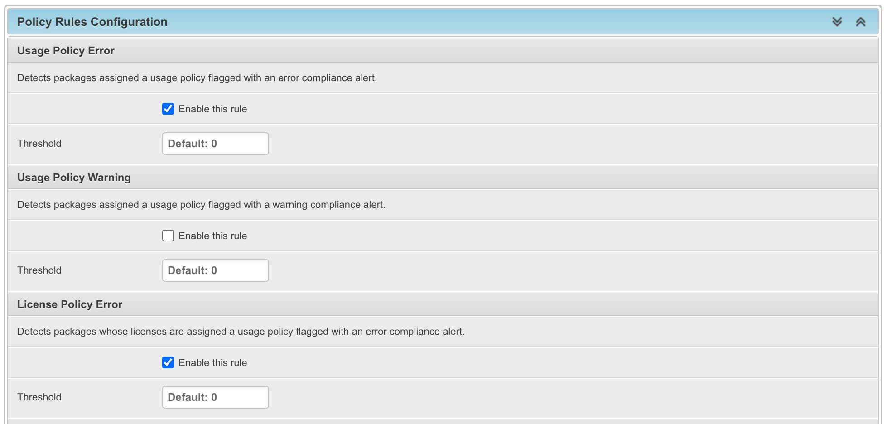
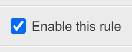
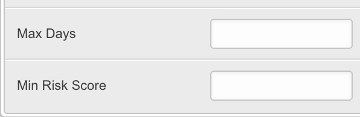

.. _how_to_6:

How To 6 - Configure Policy Rules
=================================

This chapter explains how to activate and configure the **Policy Rules Engine** for
your Dataspace. Policy rules evaluate compliance conditions against your products
automatically and record violations when thresholds are exceeded.

All rules are disabled by default. You must explicitly enable the rules that are
relevant to your compliance program and, optionally, adjust their parameters and
thresholds.

.. seealso::
    Refer to :ref:`reference_policy_rules` for a complete description of all available
    rules, configuration options, and violation lifecycle.

Access the Policy Rules Configuration
-------------------------------------

1. From the :guilabel:`Admin Dashboard`, navigate to :guilabel:`Dataspaces`.
2. Open your Dataspace by clicking on its name.
3. Scroll down to the **Policy Rules Configuration** section.

Each built-in rule is listed with its label, description, threshold, and optional
parameters.

Enable a Rule
-------------

To activate a rule check the :guilabel:`Enable this rule` checkbox.

Click :guilabel:`Save` at the bottom of the Dataspace form. DejaCode will immediately
schedule a background re-evaluation of all products in the Dataspace.

To disable a rule, uncheck the :guilabel:`Enable this rule` checkbox and save. Any
currently open violations for that rule are automatically resolved.

.. note::
    Rules that are not enabled are skipped during evaluation and any previously open
    violations for those rules are automatically resolved.

Set a Threshold
---------------

By default, a single violation is enough to trigger a rule. The :guilabel:`Threshold`
field lets you tolerate a certain number of violations before a triggered state is
recorded. Violations are only recorded when the count strictly exceeds the threshold.

For example, setting a threshold of 2 on the **License Coverage Gap** rule means the
rule is only triggered when more than 2 packages have no license expression.

This is useful when a small number of violations is acceptable during remediation
phases.

Configure Rule Parameters
-------------------------

Only vulnerability-based rules expose additional parameter fields to narrow their scope.

For the **Vulnerability Detected** rule, you can set a :guilabel:`Min Risk Score` to
restrict detection to vulnerabilities above a minimum risk score. Leave the field blank
to flag any vulnerability regardless of score.

For the **Vulnerability Stale** rule, two parameters are available:

- :guilabel:`Max Days`: the maximum number of days a high-risk vulnerability may remain
  unaddressed before the package is flagged. Defaults to 30.
- :guilabel:`Min Risk Score`: only vulnerabilities at or above this score are
  considered. Defaults to 8.0.

Investigate Violations
----------------------

Once rules are active, the number of active violations per product is displayed in
the :guilabel:`Compliance Dashboard` (select :guilabel:`Compliance` from the main menu
bar), and the triggered rules in the :guilabel:`Compliance` tab of each product.

.. seealso::
    :ref:`user_tutorial_7_policy_rules` for how users review, drill into, and resolve
    the violations.

Set Up Notifications
--------------------

DejaCode can notify external systems automatically when policy violations are detected
or resolved, without requiring manual checks of the compliance tab.

Two webhook events are available:

- ``policy.violation_detected``: fired when one or more new violations are detected
  during a rule evaluation run.
- ``policy.violation_resolved``: fired when violations are resolved.

To receive these notifications, configure a webhook in the Admin interface pointing to
your target endpoint (Slack, ticketing system, CI/CD pipeline, or any HTTP receiver).

.. seealso::
    :ref:`integrations_webhook` for instructions on creating and configuring webhooks.
