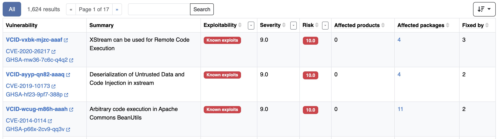
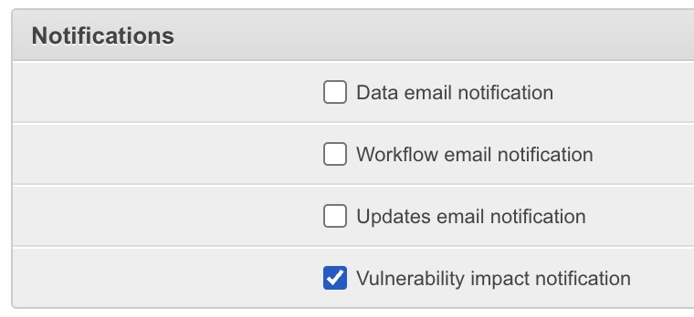
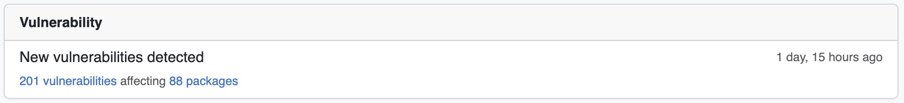
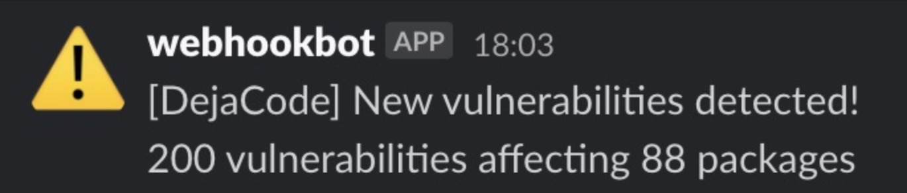

.. _reference_vulnerability_management:

Vulnerability Management
========================

DejaCode provides a comprehensive system for managing vulnerabilities in your software
products, leveraging the **VulnerableCodeDB** service for accurate and up-to-date
vulnerability data.

This documentation outlines how vulnerabilities are **collected**, **displayed**, and
**analyzed** within DejaCode.

Introduction
------------

DejaCode’s vulnerability management system relies on the **VulnerableCodeDB** service
to collect and process vulnerability data. This service is integrated into DejaCode to
provide seamless tracking and management of vulnerabilities associated with software
packages and components.

1. Enabling VulnerableCodeDB Service
------------------------------------

To utilize vulnerability management features, ensure that the **VulnerableCodeDB**
service is enabled in your Dataspace configuration.

Refer to the :ref:`dejacode_dataspace_vulnerablecode` chapter for instructions on
setting up the **VulnerableCodeDB** service in your Dataspace.

2. Collecting Vulnerability Data
---------------------------------

Vulnerabilities are fetched **daily** from the **VulnerableCodeDB** service to create
and update **Vulnerability** records in DejaCode. This ensures that vulnerability data
remains **current** and **reliable**.

In addition to the daily updates, vulnerabilities are also fetched **whenever
packages are created or modified**, ensuring their vulnerability status is always
up-to-date.

Vulnerabilities are retrieved during various **package management events**, including:

- Adding a Package using a **PURL** or download URL.
- Importing **scan data**.
- Loading **SBOMs**.
- Importing **manifests**.
- Pulling data from a **ScanCode.io project**.

.. tip:: The **latest vulnerability data refresh date** is displayed in the
  **Admin dashboard** ("Data Updates" section) and the **Integration Status** page.

  .. image:: images/reference-vulnerability-management/data-update.jpg
     :width: 300

3. Viewing Vulnerability Data
-----------------------------

DejaCode provides multiple ways to view and interact with vulnerability data through
its user interface. Below are the key areas where vulnerabilities are displayed:

- **Global Vulnerabilities List**:
  Accessible via the :guilabel:`Tools` when the **VulnerableCodeDB** service is enabled.
  This list allows you to:

  - **Sort** vulnerabilities by exploitability, severity, risk, affected package count,
    and other criteria.
  - **Filter** vulnerabilities to focus on specific risk levels or priorities.

- **Package/Component Views**:
  Vulnerabilities associated with individual packages or components are prominently
  displayed:

  - **Icons** are shown next to affected objects in list views, providing a quick
    visual indicator of vulnerability presence.

    .. image:: images/reference-vulnerability-management/package-list.jpg

  - A dedicated :guilabel:`Vulnerabilities` tab is included in detailed views, offering
    a comprehensive list of associated vulnerabilities for that package or component.

    .. image:: images/reference-vulnerability-management/vulnerabilities-tab.jpg

- **Product Views**:
  In the context of a Product, vulnerabilities are managed and reviewed through the
  :guilabel:`Vulnerabilities` tab in the Product details view. This tab provides an
  overview of all vulnerabilities affecting the Product and its associated packages or
  components.

  .. image:: images/reference-vulnerability-management/vulnerabilities-tab-product.jpg

- **Reporting**:
  Vulnerability data is fully integrated into the **reporting system**, making it
  accessible for analysis and export. Reports can leverage all vulnerability-related
  fields.

- **REST API**:
  All vulnerability data is available via the **REST API**, enabling programmatic
  access to:

  - Query and filter vulnerabilities.
  - Fetch details for packages, components, and products.

  .. seealso::
     Refer to the **API documentation** from the :guilabel:`Tools` menu for detailed
     guidance on endpoints and usage.

These features ensure that vulnerability information is seamlessly integrated into the
DejaCode platform, making it easier to assess, prioritize, and manage risks across your
software products.

4. Understanding Vulnerability Fields
--------------------------------------

The **Vulnerability** model in DejaCode provides detailed information about software
vulnerabilities. Each field captures specific aspects of a vulnerability, enabling
accurate assessment and management. Below is a description of the key fields:

- **vulnerability_id**:
  A unique identifier for the vulnerability. For example, **"VCID-2024-0001"**.

- **resource_url**:
  The URL of the data source providing details about the vulnerability.

- **summary**:
  A brief description of the vulnerability, summarizing its nature and potential impact.

- **aliases**:
  A list of alternate identifiers for the vulnerability, such as **CVE identifiers**
  (e.g., **"CVE-2017-1000136"**). This field helps link the vulnerability to related
  records.

- **exploitability**:
  Indicates the likelihood of the vulnerability being **exploited**, with the following
  options:

  - **0.5**: No known exploits.
  - **1.0**: Potential exploits exist.
  - **2.0**: Known exploits are available.

  This value is determined automatically based on the discovery of exploits and helps
  assess the risk associated with the vulnerability.

- **weighted_severity**:
  A calculated severity score derived from the highest severity value multiplied by
  its corresponding weight. This value helps prioritize vulnerabilities based on
  their potential impact.
  For example: if a vulnerability has a severity score of 9.0 with a weight of 0.5,
  the weighted severity would be 4.5.

- **risk_score**:
  A normalized score ranging from **0.0** to **10.0**, representing the **overall risk**
  posed by the vulnerability.
  The **risk score** is calculated as the maximum of the weighted severity multiplied
  by the exploitability score, capped at 10.
  **A higher risk score indicates a greater potential threat.**

These fields collectively provide a comprehensive view of each vulnerability,
supporting informed decision-making in the context of vulnerability management.

5. Product Vulnerability Analysis
---------------------------------

DejaCode provides comprehensive tools to analyze and manage vulnerabilities in the
context of specific products, streamlining the review and mitigation process.

Key Features:

- **Vulnerability Analysis Model**:
  Enables detailed assessment by assigning analysis results to specific Vulnerability
  objects and their related Product-Package instances.

- **Integrated UI Workflow**:
  Vulnerability analysis data is conveniently displayed in the Product's
  :guilabel:`Vulnerabilities` tab, where users can open a modal form to review and edit
  analysis details.

- **Data Propagation Across Products**:
  Analysis results can be propagated to other affected products containing the same
  package, reducing redundancy and ensuring consistent reviews across related items.

- **REST API Support**:
  Vulnerability analysis data is fully accessible through the REST API, enabling
  seamless integration with external tools and workflows. Use the API to retrieve,
  update, or propagate analysis data programmatically for automation and scalability.

For a step-by-step guide on using these features, refer to the dedicated
:ref:`how_to_4` section.

6. Configuration Settings
-------------------------

The vulnerability management system in DejaCode includes several configurable settings
to tailor its behavior to your organization's needs. These settings allow customization
of aspects such as **risk thresholds** for notifications and controlling the scope of
displayed vulnerabilities.

.. _vulnerabilities_risk_threshold:

vulnerabilities_risk_threshold
^^^^^^^^^^^^^^^^^^^^^^^^^^^^^^

The ``vulnerabilities_risk_threshold`` setting helps prioritize and control
attention to vulnerabilities by correlating directly with their **risk score**.
This threshold value ranges from **0.0** to **10.0**, where higher scores indicate
greater risk.

Key configuration options:

- **Global Configuration**:
  Set the threshold globally for all products in a Dataspace using the
  **Dataspace configuration form** available in the Admin interface.

  .. image:: images/reference-vulnerability-management/risk-threshold-admin.jpg
     :width: 300

- **Per-Product Configuration**:
  Define a specific threshold for individual Products through the
  **"Edit Product" form** in the Product UI.

  .. image:: images/reference-vulnerability-management/risk-threshold.jpg
     :width: 300

Vulnerabilities with a **risk score lower than the configured threshold**:

- **Do not trigger notifications** by default.
- Are **excluded** from the Product's :guilabel:`Vulnerabilities` tab by default.
- However, a link is available to manually include these lower-risk vulnerabilities
  for review, if needed.

  .. image:: images/reference-vulnerability-management/risk-threshold-link.jpg

This flexibility ensures that only the most critical vulnerabilities receive immediate
attention, while still providing access to less urgent issues for deeper analysis.

7. Notifications
-----------------

DejaCode provides a robust notification system to alert users about vulnerabilities,
ensuring timely awareness of critical issues that may impact the security of your
software products.

**Triggered Alerts**
Notifications are automatically sent whenever new vulnerabilities are discovered.

**Delivery Channels**
Notifications are displayed in the user interface and can be integrated into external
workflows using the Webhook system.

Internal Notifications
^^^^^^^^^^^^^^^^^^^^^^

To receive internal notifications about vulnerability data, a new user-specific field,
**"Vulnerability Impact Notification"**, has been introduced.

- Users with this flag activated will receive notifications each time new
  vulnerabilities are identified during the daily data update process.
- These notifications include links to:

  - **Vulnerabilities View**: A filtered list of vulnerabilities affecting the user's
    monitored packages.
  - **Package List View**: A filtered list of packages impacted by these
    vulnerabilities.

Webhook Notifications
^^^^^^^^^^^^^^^^^^^^^

A dedicated event, ``vulnerability.data_update``, is available in Webhook system.
This event is triggered each time the vulnerability data update process is completed.

- DejaCode administrators can define Webhooks, such as a Slack notification or other
  integrations, to be executed when this event occurs.
- This integration allows organizations to incorporate DejaCode notifications into
  their external workflows for enhanced vulnerability management.

8. CycloneDX and CSAF VEX Outputs
---------------------------------

DejaCode supports exporting vulnerability data in two widely recognized,
**industry-standard formats**:

- **CycloneDX VEX**:
  A `Vulnerability Exploitability eXchange (VEX) <https://cyclonedx.org/capabilities/vex/>`_
  format that provides detailed vulnerability information in the context of SBOMs
  (Software Bill of Materials).
  This format is tailored for efficient communication of exploitability status across
  supply chain tools.

- **CSAF VEX**:
  The `Common Security Advisory Framework (CSAF) VEX <https://docs.oasis-open.org/csaf/csaf/v2.0/os/csaf-v2.0-os.html>`_
  is another standard designed for sharing security advisories, particularly focused
  on providing structured, actionable vulnerability details.

These exports help ensure compatibility with a wide range of external tools used in
software security and supply chain management.

- **Customizable Options**:
  DejaCode allows exporting **CycloneDX VEX-only** reports or combined outputs such as
  **SBOM + VEX** for enriched context.

.. tip::
   Using these standardized formats streamlines integration with external systems,
   enabling efficient sharing of vulnerability insights and improved collaboration
   across your security and development teams.
