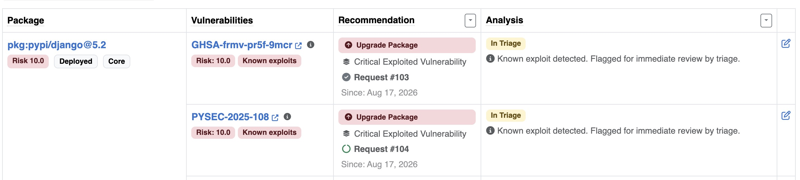
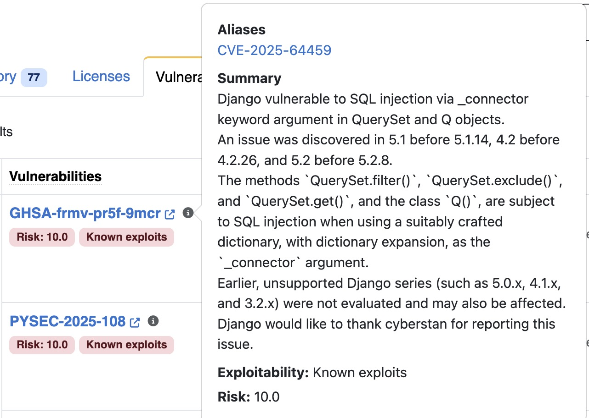

.. _reference_vulnerability_triage:

Vulnerability Triage Engine
===========================

DejaCode includes a **Vulnerability Triage Engine** that evaluates configurable
detection rules against your product inventory and recommends a remediation action for
each matched vulnerability. It provides a structured way to prioritize, track, and act
on vulnerability exposure across your products.

When a ruleset fires, DejaCode creates a **triage record** linking the vulnerability to
the product and the ruleset that detected it. The record carries the recommended action,
the detection date, the last evaluation date, and an optional link to a DejaCode request
opened automatically by the engine.

Rulesets are **disabled by default**. Each dataspace creates and configures the rulesets
that are relevant to its security program via the **Admin** interface.

1. Built-in Rules
-----------------

Eight rules are available out of the box. Each rule implements a specific detection
condition evaluated against the vulnerabilities known to affect the product's packages.

.. list-table::
   :header-rows: 1
   :widths: 28 72

   * - Label
     - Description
   * - | **Risk Score**
       | ``risk_score``
     - Detects vulnerabilities whose risk score is at or above the configured threshold.
   * - | **Weighted Risk**
       | ``weighted_risk``
     - Detects vulnerabilities affecting at least one package whose weighted risk score
       meets the configured threshold. The weighted risk score combines the vulnerability
       risk with the package's exposure level in the product.
   * - | **Exploited Vulnerability**
       | ``exploited_vulnerability``
     - Detects vulnerabilities for which a known active exploit is available
       (exploitability value equals 2.0).
   * - | **SSVC Decision**
       | ``ssvc_decision``
     - Detects vulnerabilities whose `SSVC <https://www.cisa.gov/ssvc-calculator>`_
       decision tree recommends **Attend** or **Act** (immediate attention required).
       Matches if any of the vulnerability's published SSVC trees meets this threshold.
   * - | **Reachable Vulnerability**
       | ``reachable_vulnerability``
     - Detects vulnerabilities confirmed as reachable in the product context: at least
       one VulnerabilityAnalysis record for this vulnerability has ``is_reachable`` set
       to true.
   * - | **Unresolved Vulnerability**
       | ``unresolved_vulnerability``
     - Detects vulnerabilities affecting the product where at least one package has no
       completed triage analysis (i.e., no analysis in a terminal state: resolved,
       resolved_with_pedigree, or not_affected).
   * - | **Stale Vulnerability**
       | ``stale_vulnerability``
     - Detects high-risk vulnerabilities that have remained unaddressed beyond the
       configured number of days. Considers only vulnerabilities whose risk score meets
       or exceeds the configured minimum.
   * - | **Dev-Only Vulnerable Package**
       | ``dev_only_vulnerable_package``
     - Detects vulnerabilities that exclusively affect packages marked as non-deployed
       in the product, indicating a lower exposure risk.

.. seealso::
    Refer to :ref:`reference_vulnerability_management` for background on vulnerability
    fields such as risk score and exploitability.

1.1 Rule Parameters
^^^^^^^^^^^^^^^^^^^

The following parameters are supported by rules that accept them:

**Risk Score** (``risk_score``)

- ``min_risk_score`` (float, 0.0-10.0): only flag vulnerabilities whose risk score is
  greater than or equal to this value. Defaults to ``8.0``.

**Weighted Risk** (``weighted_risk``)

- ``min_weighted_risk_score`` (float, 0.0-10.0): only flag vulnerabilities affecting a
  package whose weighted risk score is greater than or equal to this value. Defaults to
  ``8.0``.

**Stale Vulnerability** (``stale_vulnerability``)

- ``max_days`` (integer, min 1): maximum number of days a high-risk vulnerability may
  remain without a completed analysis before it is flagged. Defaults to ``30``.
- ``min_risk_score`` (float, 0.0-10.0): only consider vulnerabilities whose risk score
  is greater than or equal to this value. Defaults to ``8.0``.

2. Triage Actions
-----------------

Each ruleset recommends a single remediation action. The action is stored on every
triage record created by that ruleset and displayed in the **Recommendation** column
of the product Vulnerabilities tab.

.. list-table::
   :header-rows: 1

   * - Action
     - Label
   * - ``upgrade``
     - Upgrade Package
   * - ``apply_patch``
     - Apply Patch
   * - ``forensic_analysis``
     - Forensic Analysis
   * - ``reachability_analysis``
     - Reachability Analysis
   * - ``change_config``
     - Change Configuration
   * - ``replace_package``
     - Replace Package
   * - ``notify``
     - Notify
   * - ``create_request``
     - Create DejaCode Request

3. Triage Record Lifecycle
--------------------------

A **triage record** is created per (vulnerability, product, ruleset) combination the
first time a ruleset evaluation matches a vulnerability. Its lifecycle follows these
states:

- **Detected**: the record is created the first time the ruleset fires for the
  vulnerability. ``detected_date`` is set at this point and never changes on subsequent
  evaluations.
- **Active**: the record is updated in place on each subsequent evaluation as long as
  the vulnerability still matches any active rule in the ruleset. ``last_checked`` is
  updated on every run.
- **Deleted**: when a vulnerability no longer matches any rule in the ruleset, its
  triage record is deleted. Any preset-applied analysis for that vulnerability is also
  removed. If the conditions recur later, a new record is created with a fresh
  ``detected_date``.

Only **active** triage records appear in the product Vulnerabilities tab.

4. Configuration
----------------

The triage engine is configured through **Triage Rulesets** in the Admin interface
under :guilabel:`Vulnerabilities > Triage Rulesets`.

.. seealso::
    For step-by-step instructions on creating and configuring rulesets through the Admin
    UI, refer to :ref:`how_to_7`.

4.1 Triage Ruleset
^^^^^^^^^^^^^^^^^^

Each ruleset combines one or more detection rules with a single recommended action:

.. list-table::
   :header-rows: 1

   * - Field
     - Description
   * - **Name**
     - A descriptive name for the ruleset (e.g., "Critical Vulnerabilities").
   * - **Action**
     - The remediation action to recommend when the ruleset fires.
   * - **Precedence**
     - Integer controlling priority when multiple rulesets match the same vulnerability
       for the same product. The ruleset with the highest precedence value wins and its
       triage record is displayed. Unique per dataspace, so ties cannot occur.
   * - **Enabled**
     - When unchecked, the ruleset is excluded from all evaluations and its existing
       triage records are deleted immediately. Any preset-applied analysis is left in
       place: only the tracking record is removed, not the analysis itself.
   * - **Analysis Preset**
     - Optional. An AnalysisPreset whose default values are applied automatically to
       each matched vulnerability (see section 4.2).
   * - **Request Template**
     - Optional. A RequestTemplate of content type Product used to open a DejaCode
       request automatically for each new triage record (see section 4.3).

4.2 Analysis Preset
^^^^^^^^^^^^^^^^^^^

An **Analysis Preset** defines default vulnerability analysis values that the engine
applies automatically to each (product_package, vulnerability) pair matched by the
ruleset.

.. list-table::
   :header-rows: 1

   * - Field
     - Description
   * - **State**
     - Default analysis state (e.g., ``in_triage``).
   * - **Justification**
     - Default justification value.
   * - **Responses**
     - Default response values (multiple choice).
   * - **Detail**
     - Default free-text detail.
   * - **Is Reachable**
     - Default reachability flag (true/false/unknown).

Only non-blank preset fields are applied to each analysis. User-owned analyses (those
not created by a preset) are never overwritten. When a user edits an auto-applied
analysis, it becomes user-owned and the engine will not modify it again.

Analysis Presets are managed in the Admin interface under
:guilabel:`Vulnerabilities > Analysis Presets`.

.. seealso::
    Refer to :ref:`how_to_4` for the meaning of each analysis field (State,
    Justification, Responses, Detail).

4.3 Request Template
^^^^^^^^^^^^^^^^^^^^

When a **Request Template** is assigned to a ruleset, the engine automatically opens
one DejaCode request per new triage record using the template's title and content as
defaults.

Key behaviors:

- The template must be of content type **Product**.
- The engine uses the request template's creator as the requester. A request template
  with no creator cannot be selected on a ruleset: this is validated when the ruleset
  is saved, both in the Admin and through the REST API.
- The request is linked to the triage record. Users can navigate to it directly from
  the Recommendation column in the Vulnerabilities tab.
- Requests are created once per triage record. Re-evaluation does not open additional
  requests for an existing record.

4.4 Seeding Reference Rulesets
^^^^^^^^^^^^^^^^^^^^^^^^^^^^^^

A set of reference rulesets and analysis presets, covering common scenarios (critical
exploited vulnerabilities, reachable vulnerabilities, stale vulnerabilities, dev-only
packages, and more) can be seeded into a dataspace with the ``create_triage_rulesets``
management command::

    ./manage.py create_triage_rulesets <dataspace_name>

The command refuses to run if the dataspace already has triage rulesets. Pass
``--reset`` to delete all existing rulesets and presets in the dataspace first and
recreate them from scratch; you will be prompted for confirmation unless ``--noinput``
is also passed. Resetting removes every product's ruleset assignments, which must be
redone manually afterward.

5. Evaluation
-------------

5.1 Automatic Evaluation
^^^^^^^^^^^^^^^^^^^^^^^^^

The engine re-evaluates a product's assigned rulesets automatically and immediately
whenever any of the following changes occur, so results are reflected on the very next
page reload without any manual action:

- A **ruleset** already assigned to one or more products is edited and saved, from the
  Admin interface or through the REST API: every assigned product is re-evaluated.
- A **ruleset is assigned to or unassigned from** a product, from the product
  Vulnerabilities tab or through the REST API.
- A **package is added to or removed from** a product.
- A **VulnerabilityAnalysis** record for a package in the product is saved or deleted.

.. note::
    Bulk operations (importing a CSV of packages, importing a ScanCode.io scan, or
    cloning a product) evaluate each affected product once in the background after the
    import completes, instead of once per imported row. Results may take a short moment
    to appear after a large bulk import.

5.2 Manual Re-evaluation
^^^^^^^^^^^^^^^^^^^^^^^^^

A full re-evaluation of every enabled ruleset against every product in a dataspace can
be triggered from the command line::

      ./manage.py evaluate_triage <dataspace_name>

This is intended for scheduled runs or recovery after data changes.

6. Vulnerabilities Tab
----------------------

The **Vulnerabilities** tab on each product detail page provides a per-vulnerability
view of the product's affected packages. When at least one enabled ruleset is assigned
to the product, a **Recommendation** column appears. A link to open the
:guilabel:`Manage Triage Rulesets` panel is available from the tab's navigation bar for
users with change permission on the product.

For each vulnerability row, the Recommendation cell shows:

- The recommended **action** (colored badge).
- The **ruleset name** that produced the recommendation.
- The **detection date** (Since).
- A link to the **associated request**, if one was opened automatically.

When multiple rulesets are assigned and their rules overlap on the same vulnerability,
only the record from the highest-precedence ruleset is displayed.

Hovering the info icon next to a vulnerability ID shows a popover with its aliases,
summary, exploitability, and risk score.

Vulnerability analysis values (state, justification, responses, reachability) are
shown in adjacent columns and can be edited inline via the edit icon. When an analysis
was auto-applied by a preset, an "Auto-applied" indicator with the preset name is shown
in place of the usual last-modified-by information.

The table can be filtered by **Triage action**, **Analysis state**, **Justification**,
**Responses**, and **Reachability**.

7. REST API
-----------

A product's active triage recommendations are accessible via the REST API at::

    GET /api/v2/products/{uuid}/triage_records/

The response is a list of active recommendations, one entry per vulnerability, from
the highest-precedence matching ruleset, each including:

- ``advisory_id``: the vulnerability identifier.
- ``ruleset``: the name of the ruleset that produced the recommendation.
- ``recommended_action``: the remediation action.
- ``matched_rules``: the rule types that matched.
- ``request``: a string representation of the associated request, or ``null``.
- ``detected_date`` and ``last_checked``.

Triage rulesets and analysis presets support full create, retrieve, update, and delete
operations at::

    /api/v2/triage_rulesets/
    /api/v2/analysis_presets/

A product's ruleset assignments can be listed and managed at::

    GET /api/v2/products/{uuid}/manage_triage_rulesets/
    POST /api/v2/products/{uuid}/manage_triage_rulesets/

The ``GET`` response lists every enabled ruleset in the product's dataspace, each
flagged with an ``assigned`` boolean. The ``POST`` endpoint assigns or unassigns one
ruleset at a time and re-evaluates the product immediately::

    {"ruleset": "<uuid>", "assigned": true}

Vulnerability analyses, including whether they were auto-applied by a preset, are also
available at ``/api/v2/vulnerability_analyses/``.
