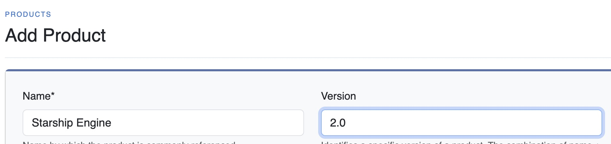
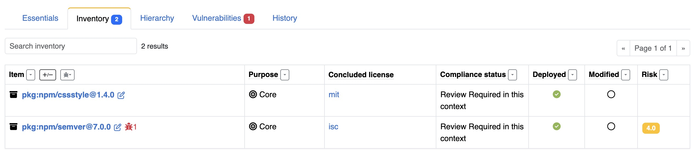
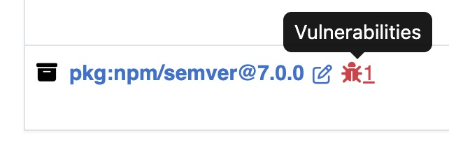

.. _user_tutorial_4_vulnerabilities:

Tutorial 4 - Import Scan Results into a Product
===============================================

.. note::
    **Before you start**:

    - Permission to add Products.
    - The VulnerableCodeDB integration
      (:ref:`dejacode_dataspace_vulnerablecode`) enabled in your Dataspace.

Sign in to DejaCode.

Create a Product
----------------

1. Select :guilabel:`Products` from the main menu bar.

2. Click the green :guilabel:`Add Product` button. Enter the values you know.
   Refer to :ref:`data_model_product` for details about each field.

3. Set a **name**, then click the :guilabel:`Add Product` button at the bottom
   of the form.

Load Scan Results to your Product
---------------------------------

1. Download the following ScanCode Scan results example from:

   `<https://github.com/aboutcode-org/dejacode/raw/refs/heads/main/docs/sboms/starship_engine_2.0_scan_results.json>`_.

2. On the Product details page, from the :guilabel:`Actions` dropdown, select
   :guilabel:`Import ScanCode scan results`:

   * Click the :guilabel:`Choose File` button under the **Scan results JSON file** field.
   * Select the **starship_engine_2.0_scan_results.json** file and click the
     :guilabel:`Open` button.
   * Click the :guilabel:`Import` button.

.. image:: images/tutorial-4-vulnerabilities/action-import-from-scan.jpg
   :width: 300

3. View your import results in the :guilabel:`Inventory` tab.

4. Vulnerable packages are marked with an icon.

Review, Analyze, and Export Vulnerabilities
-------------------------------------------

Your Product inventory now includes vulnerable packages. Continue with the same steps
as for an imported SBOM, in :ref:`user_tutorial_5_sboms`:

1. :ref:`user_tutorial_5_review_vulnerabilities`
2. :ref:`user_tutorial_5_vulnerability_analysis`
3. :ref:`user_tutorial_5_export_vex`
