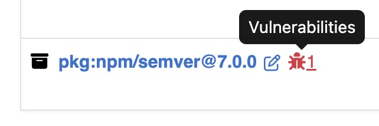

.. _user_tutorial_4_vulnerabilities:

Tutorial 4 - Managing Product Vulnerabilities
=============================================

Sign into DejaCode.

Create a Product
----------------

1. Select :guilabel:`Products` from the main menu bar.

2. Click the green :guilabel:`Add Product` button. Enter the values you know.
   Refer to :ref:`data_model_product` for details about each field.

3. Set a **name**, then click the :guilabel:`Add Product` button at the bottom
   of the form.

Load Scan Results to your Product
---------------------------------

1. Download the following ScanCode Scan results example from:

   `<https://github.com/aboutcode-org/dejacode/tree/main/docs/sboms/starship_engine_2.0_scan_results.json>`_.

2. On the Product details page, from the :guilabel:`Actions` dropdown, select
   :guilabel:`Import ScanCode scan results`:

   * Click the :guilabel:`Choose File` button under the **Upload file** field.
   * Select the **starship_engine_2.0_scan_results.json** file and click the
     :guilabel:`Open` button.
   * Click the :guilabel:`Import` button.

3. View your import results in the :guilabel:`Inventory` tab.

4. Vulnerable packages are marked with an icon.

Review Vulnerabilities Affecting Your Product
---------------------------------------------

1. Navigate to the :guilabel:`Vulnerabilities` tab on the Product page, which presents
   a comprehensive view of all the Vulnerabilities for your Product filtered to those
   with a Risk greater than the Risk Threshold defined for your Dataspace.

2. You can sort and filter by Risk, Exploitability and Severity, as well as other
   fields, to focus on specific Vulnerabilities.

Conduct Vulnerability Analysis
------------------------------

1. Review each vulnerability in the :guilabel:`Vulnerabilities` tab.

2. Add details or analysis for each vulnerability as needed, which will
   enhance reporting and exports.

Export CycloneDX SBOM with VEX
------------------------------

1. On the Product details page, from the :guilabel:`Share` dropdown, select
   :guilabel:`CycloneDX SBOM + VEX`.

.. image:: images/tutorial-4-vulnerabilities/share-cdx.jpg
   :width: 300

2. The analysis details you provide for product package vulnerabilities are
   included in the ``vulnerabilities`` section of the CycloneDX VEX output.
