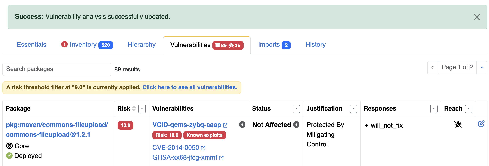

.. _user_tutorial_5_sboms:

Tutorial 5 - Working with SBOMs in a Product
============================================

You have just received a Software Bill of Materials (SBOM) from your supplier.
Sign into DejaCode.

Create a Product
----------------

1. Select :guilabel:`Products` from the main menu bar.

2. Click the green :guilabel:`Add Product` button. Enter the values you know.
   Refer to :ref:`data_model_product` for details about each field.

3. Set a **name**, then click the :guilabel:`Add Product` button at the bottom
   of the form.

Load an SBOM to your Product
----------------------------

1. Download and unzip the following SBOM example from:

   `<https://github.com/aboutcode-org/dejacode/raw/refs/heads/main/docs/sboms/storm-core-1.0.1.cdx.json.zip>`_.

2. On the Product details page, from the :guilabel:`Action` dropdown, select
   :guilabel:`Load Packages from SBOMs`:

   * Click the Browse field beneath :guilabel:`SBOM file or zip archive`
   * Select the **storm-core-1.0.cdx.json** file and leave the additional options
     unchecked and click the :guilabel:`Load Packages` button.

.. image:: images/tutorial-5-sboms/action-load-packages-from-sbom.jpg
   :width: 300

3. Click the :guilabel:`Imports` tab to view your progress.

.. image:: images/tutorial-5-sboms/imports-tab-1.jpg

4. View your import results in the :guilabel:`Inventory` tab.

5. You can enrich the data provided by your supplier,
   From the :guilabel:`Action` dropdown, select
   :guilabel:`Improve Packages from PurlDB`:

6. Click the :guilabel:`Imports` tab to view your progress.

7. Return to the :guilabel:`Inventory` tab.

8. Filter the Inventory by :guilabel:`Compliance status` to determine which packages
   may require additional curation. Select :guilabel:`Review Required in this context`.

9. Click the pencil icon in the Item column to review a Package. Use the modal form
   to update the :guilabel:`Concluded license expression` and select the
   :guilabel:`Approved in this context` and click the :guilabel:`Update` button.

.. image:: images/tutorial-5-sboms/product-package-relationship.jpg

10. Unfilter the Inventory by selecting :guilabel:`All`
    from the :guilabel:`Compliance status` dropdown.

Review Vulnerabilities Affecting Your Product
---------------------------------------------

1. You can filter Inventory by vulnerable packages.

2. Navigate to the :guilabel:`Vulnerabilities` tab on the Product page, which presents
   a comprehensive view of all the Vulnerabilities for your Product filtered to those
   with a Risk greater than the Risk Threshold defined for your Dataspace.

3. You can sort and filter by Risk, Exploitability and Severity, as well as other
   fields, to focus on specific Vulnerabilities.

4. You can set a specific Risk Threshold for your Product. Click the pencil icon
   next to the Product name, scroll down to :guilabel:`Vulnerabilitiesrisk threshold`
   and enter a value such as 9 and click the :guilabel:`Update Product` button
   to filter your results to show only critical items.

Conduct Vulnerability Analysis
------------------------------

1. Review each vulnerability in the :guilabel:`Vulnerabilities` tab.

2. Add details or analysis for each vulnerability as needed, which will
   enhance reporting and exports.

Export CycloneDX SBOM with VEX
------------------------------

1. On the Product details page, from the :guilabel:`Share` dropdown, select
   :guilabel:`CycloneDX SBOM + VEX`.

2. The analysis details you provide for product package vulnerabilities are
   included in the ``vulnerabilities`` section of the CycloneDX VEX output.
