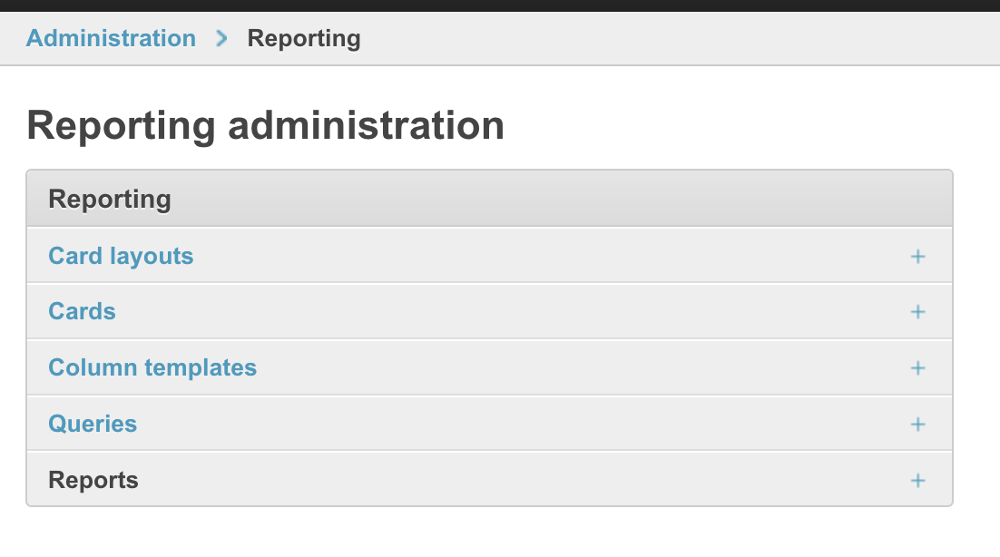
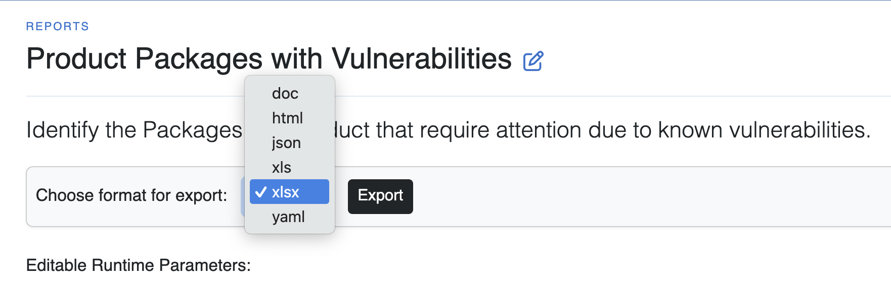

.. _user_tutorial_6_vuln_report:

Tutorial 6 - Create a Product Vulnerability Report
==================================================

You received a Software Bill of Materials (SBOM) from your supplier, and you have
loaded it into a DejaCode Product as described in :ref:`user_tutorial_5_sboms`.
You would like to create a Report to analyze the vulnerabilities in
that Product, share it with your team, and track your issue resolution progress.

Sign into DejaCode.

Create a DejaCode Query
-----------------------

1. Select :guilabel:`Dashboard` from the dropdown menu under your user name.

2. Scroll down and select :guilabel:`Queries` from the Reporting section of the
   Administrator dashboard.

3. Click the :guilabel:`Add query` button in the upper right section of the
   Administrator Queries changelist form.

4. Identify the Query.

   * Enter the **Name** "Product Packages with Vulnerabilities".
   * Enter the **Description** "Select the Packages assigned to a Product for which
     there are known vulnerabilities."
   * Select the **Object type** "Product Portfolio | product package relationship".
   * Accept the default **Operator** value "and".

5. Define the Query Filters.

   * Scroll down to the :guilabel:`Filters` section of the form and click the
     **Add another filter** command.
   * Select "Product>>" from the :guilabel:`Field Name` list.
   * Select "name" from the list of Product fields.
   * Select "Case-insensitive exact match" from the :guilabel:`Lookup` list.
   * Enter "Starship Controller" (without the quotes) in the :guilabel:`Value` field.
   * Check the :guilabel:`Runtime Parameter` option.
   * Accept the default unchecked :guilabel:`Negate` option.

   * Click the **Add another filter** command.
   * Select "Product>>" from the :guilabel:`Field Name` list.
   * Select "version" from the list of Product fields.
   * Select "Case-insensitive exact match" from the :guilabel:`Lookup` list.
   * Enter "2.0" (without the quotes) in the :guilabel:`Value` field.
   * Check the :guilabel:`Runtime Parameter` option.
   * Accept the default unchecked :guilabel:`Negate` option.

   * Click the **Add another filter** command.
   * Select "weighted_risk_score" from the :guilabel:`Field Name` list.
   * Select "Greater than or equal to" from the :guilabel:`Lookup` list.
   * Enter "3"  (without the quotes) in the :guilabel:`Value` field.
   * Check the :guilabel:`Runtime Parameter` option.
   * Accept the default unchecked :guilabel:`Negate` option.

   * In the lower right section of the form, click the
     :guilabel:`Save and continue editing` button.

6. Define the Query Order.

   * In the :guilabel:`Order Fields` section of the form click the
     **Add another order field** command.
   * Select "weighted_risk_score" from the :guilabel:`Field Name` list.
   * Select "descending" from the :guilabel:`Sort` list.

   * Click the **Add another order field** command.
   * Select "package" from the :guilabel:`Field Name` list.
   * Select "ascending" from the :guilabel:`Sort` list.

   * In the lower right section of the form, click the
     :guilabel:`Save and continue editing` button.

Create a DejaCode Column Template
---------------------------------

1. In the upper left section of the Change query form, click the
   :guilabel:`Reporting` option in the navigation path.

2. On the Reporting Administration form select :guilabel:`Column templates` .

3. Click the :guilabel:`Add column template` button in the upper right section of the
   Administrator Column templates changelist form.

4. Identify the Column Template.

   * Enter the **Name** "Product Packages with Vulnerabilities".
   * Enter the **Description** "Identify the Packages in a Product that require
     attention due to known vulnerabilities."
   * Select the **Object type** "Product Portfolio | product package relationship".

5. Define the Column Template Fields.

   * Scroll down to the :guilabel:`Column Template Assigned Fields` section of the
     form and click the **Add another column template assigned field** command.
   * Select "product>>" from the :guilabel:`Field Name` list.
   * Select "name" from the list of Product fields.
   * Enter "Product" in the :guilabel:`Display name` field.

   * Click the **Add another column template assigned field** command.
   * Select "product>>" from the :guilabel:`Field Name` list.
   * Select "version" from the list of Product fields.
   * Enter "Version" in the :guilabel:`Display name` field.

   * Click the **Add another column template assigned field** command.
   * Select "weighted_risk_score" from the :guilabel:`Field Name` list.
   * Enter "Risk" in the :guilabel:`Display name` field.

   * Click the **Add another column template assigned field** command.
   * Select "package>>" from the :guilabel:`Field Name` list.
   * Select "filename" from the list of package fields.
   * Enter "Filename" in the :guilabel:`Display name` field.

   * Click the **Add another column template assigned field** command.
   * Select "is_deployed" from the :guilabel:`Field Name` list.
   * Enter "Deployed" in the :guilabel:`Display name` field.

   * Click the **Add another column template assigned field** command.
   * Select "is_modified" from the :guilabel:`Field Name` list.
   * Enter "Modified" in the :guilabel:`Display name` field.

   * Click the **Add another column template assigned field** command.
   * Select "notes" from the :guilabel:`Field Name` list.
   * Enter "Notes" in the :guilabel:`Display name` field.

   Continue adding fields as illustrated below.

   * In the lower right section of the form, click the
     :guilabel:`Save and continue editing` button.

Optionally select and hold the "Move" button on the right side of the
Column Template Assigned Fields grid to re-order the Fields.

.. note::
    For the purpose of this tutorial, you are instructed to define a column template
    from scratch. You may also find it useful to open an existing column template
    to use as a starting point, add and delete the columns that you need, provide a
    new Name, and use the :guilabel:`Save as new` button to create the new one.

Create a DejaCode Report
------------------------

1. In the upper left section of the Change column template form, click the
   :guilabel:`Reporting` option in the navigation path.

2. On the Reporting Administration form select :guilabel:`Reports` .

3. Click the :guilabel:`Add report` button in the upper right section of the
   Administrator Reports changelist form.

4. Specify the Report.

   * Enter the **Name** "Product Packages with Vulnerabilities".
   * Enter the **Description** "Identify the Packages in a Product that require
     attention due to known vulnerabilities."
   * Select the **Product Packages with Vulnerabilities** Query.
   * Select the **Product Packages with Vulnerabilities** Column Template.
   * Check the :guilabel:`User available` option.

   * In the lower right section of the form, click the
     :guilabel:`Save and continue editing` button.

5. View the Report.

   * In the upper right section of the Change Report form, click the
     :guilabel:`View` button.
   * Review the Report results.
   * Optionally, modify the weighted_risk_score parameter value to 9 and click the
     :guilabel:`Rerun Report` button.
   * Review the impact of your parameter change.

6. Share the Report.

   * Just above the Report Parameters section, accept the default "xlsx" format and
     click the :guilabel:`Export` button.
   * Share the exported spreadsheet with your team.

.. note::
    Since you specified "User available" for this report, it is also available on
    the Reports page. Access that page using the "Reports" option of the "Tools"
    dropdown from the main DejaCode menu bar.
