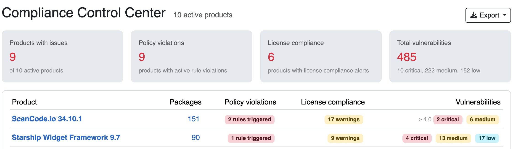
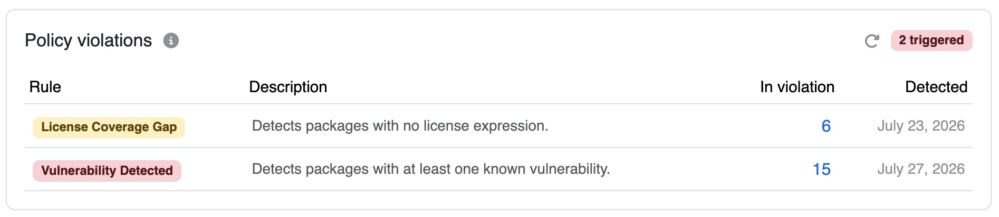
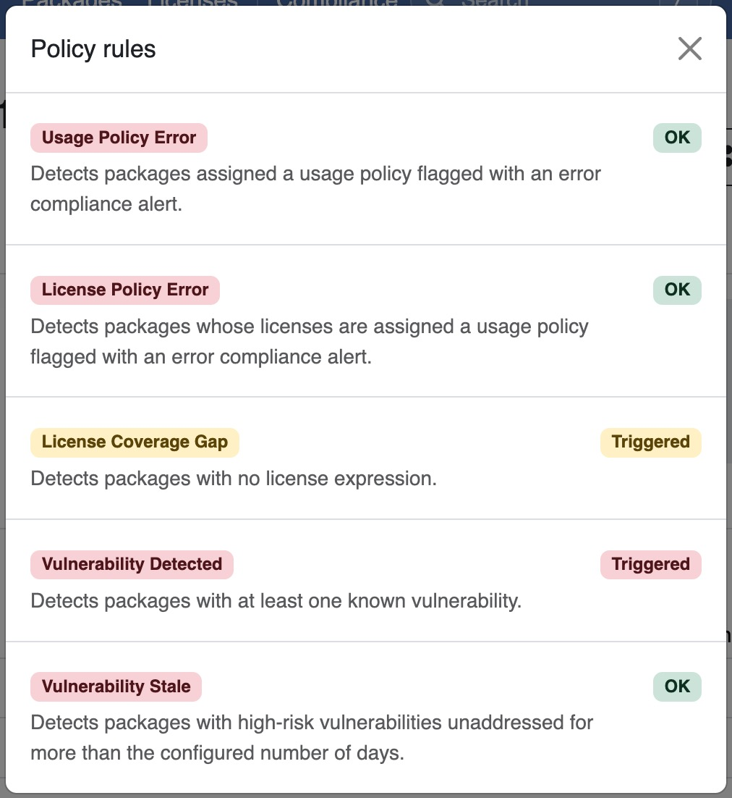
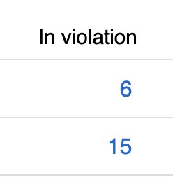
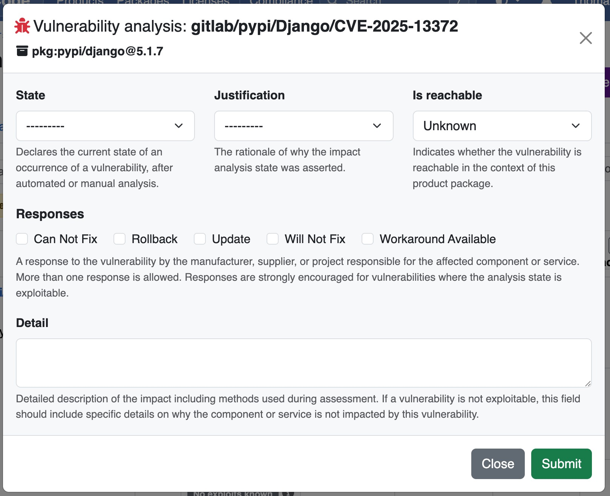
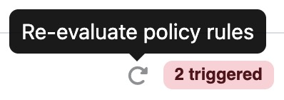

Tutorial 7 - Managing Policy Violations
=======================================

Your DejaCode administrator has configured policy rules for your Dataspace. This
tutorial walks you through discovering policy violations on a product, understanding
what they mean, drilling into the affected packages, and resolving them.

.. seealso::
    Refer to :ref:`reference_policy_rules` for a complete description of all available
    rules and their violation lifecycle. If you are an administrator and need to enable
    or configure rules, refer to :ref:`how_to_6`.

Sign into DejaCode.

1. Open the Compliance Dashboard
--------------------------------

1. From the main menu, navigate to the :guilabel:`Compliance Dashboard`.

2. The dashboard lists all your products with their compliance metrics. Look at the
   **Policy violations** column to see which products have active violations.

3. Click the policy violations count on a product row to open its
   :guilabel:`Compliance` tab directly.

2. Review Policy Violations
---------------------------

The **Policy violations** panel shows the active violations for the product.

For each triggered rule, the table shows:

- The rule label and severity, color-coded as red (error) or yellow (warning).
- A short description of what the rule detects.
- The number of packages **in violation**.
- The date the violation was first **detected**.

The badge in the panel header shows the total number of triggered rules. Its color
reflects the highest severity: red if at least one error rule is triggered, yellow
if only warning rules are triggered.

.. tip::
    Click the info icon next to the panel title to open a modal listing all active
    rules with their current status: **Triggered** or **OK**. This gives you a full
    picture of your overall compliance status at a glance.

3. Drill Into Affected Packages
-------------------------------

1. In the **Policy violations** table, click the count in the **In violation** column
   for the rule you want to investigate.

2. The :guilabel:`Inventory` tab opens pre-filtered to show only the packages that
   triggered that rule.

3. Review the packages and decide what action to take: update a license expression,
   assign a usage policy, or triage a vulnerability.

4. Resolve a Violation
----------------------

Violations are resolved automatically when the underlying condition is corrected.
The following example shows how to resolve a **Vulnerability Unresolved** violation
by completing a vulnerability analysis.

1. From the filtered inventory, click a package to open its detail page.
2. Navigate to the :guilabel:`Vulnerabilities` tab.
3. For each vulnerability, click :guilabel:`Edit analysis` and set the analysis state
   to a terminal value such as **Resolved** or **Not affected**.

.. seealso::
    Refer to :ref:`how_to_4` for a detailed guide on vulnerability analysis.

Once all vulnerabilities on a package have a terminal analysis, that package is no
longer counted as a violation for the **Vulnerability Unresolved** rule.

5. Re-evaluate and Confirm
--------------------------

After correcting the underlying condition, trigger a manual re-evaluation to update
the violation count immediately rather than waiting for the next automatic run.

1. Return to the :guilabel:`Compliance` tab of the product.
2. Click the re-evaluate button next to the **Policy violations** panel header.

3. The panel refreshes with updated violation counts. Rules whose conditions are no
   longer met are cleared from the table.
