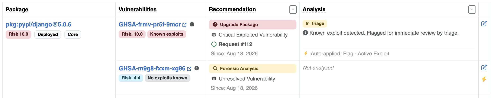
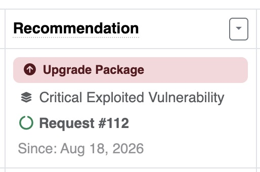
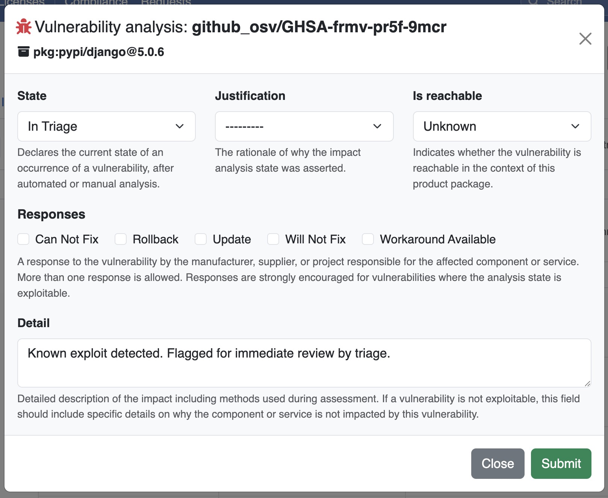

.. _user_tutorial_8_vulnerability_triage:

Tutorial 8 - Vulnerability Triage
=================================

Your DejaCode administrator has set up triage rulesets for your Dataspace, and one or
more of them have been assigned to the product you want to review. This tutorial walks
you through discovering triage recommendations on a product, understanding what they
mean, recording your vulnerability analysis, and tracking the associated requests.

.. seealso::
    Refer to :ref:`reference_vulnerability_triage` for a complete description of all
    available rules, actions, and triage record lifecycle. If you are an administrator
    and need to create or configure rulesets, refer to :ref:`how_to_7`. If this is your
    first time reviewing a product's vulnerabilities, start with
    :ref:`user_tutorial_4_vulnerabilities`.

Sign into DejaCode.

1. Open the Vulnerabilities Tab
-------------------------------

1. From the main navigation, browse to the product you want to review.
2. Open the product detail page and navigate to the :guilabel:`Vulnerabilities` tab.

The tab lists all packages in the product that have known vulnerabilities. Each package
row expands to show the individual vulnerabilities that affect it, along with their
risk scores and exploitability indicators. Hover the info icon next to a vulnerability
ID for a quick summary of its aliases, description, exploitability, and risk score.

When triage rulesets are assigned to the product, a :guilabel:`Recommendation` column
appears between the vulnerability ID and the analysis status columns. If you do not
see this column, no ruleset is assigned to this product yet: refer to
:ref:`how_to_7_assign_rulesets` for how to assign one.

2. Read the Recommendation Column
---------------------------------

Each row in the Recommendation column can show up to four pieces of information:

- **Action badge**: the remediation action recommended by the highest-precedence
  ruleset that matched this vulnerability (e.g., **Upgrade Package**,
  **Reachability Analysis**, **Notify**).
- **Ruleset name**: the name of the ruleset that produced the recommendation.
- **Since**: the date when the triage engine first detected this vulnerability for
  this product.
- **Request link**: if a DejaCode request was opened automatically for this
  vulnerability, a link appears here. Click it to open the request in a new tab.

If a vulnerability row has no recommendation badge, no enabled ruleset currently
matches it for this product.

3. Filter and Prioritize
------------------------

Use the filter controls at the top of the Vulnerabilities tab to narrow down the list:

- Filter by **Triage action** to focus on vulnerabilities requiring a specific
  remediation (e.g., show only those flagged for an upgrade).
- Filter by **Risk score** to surface the most critical vulnerabilities first.
- Filter by **Analysis state** to identify vulnerabilities not yet triaged.

4. Record a Vulnerability Analysis
----------------------------------

The Recommendation column tells you what action to take. To record your analysis
findings:

1. In the vulnerability row, click the edit icon on the right side of the row.
2. An analysis modal opens for that package and vulnerability combination.
3. Fill in the fields that apply to your findings:

   - **State**: select the analysis state that reflects your conclusion (e.g.,
     *In Triage*, *Resolved*, *Not Affected*).
   - **Justification**: select the reason for your conclusion if applicable.
   - **Responses**: select one or more response actions you are taking.
   - **Is Reachable**: indicate whether the vulnerability is reachable in this
     product's runtime context.
   - **Detail**: add any free-text notes for your team.

4. Click :guilabel:`Save`. The analysis values appear in the row immediately.

.. seealso::
    Refer to :ref:`how_to_4` for a detailed guide on vulnerability analysis fields
    and their meaning.

.. note::
    If an Analysis Preset was configured for the ruleset, some fields may already be
    pre-filled when you open the modal. An "Auto-applied" indicator with the preset
    name appears in the row for these analyses instead of the usual last-modified-by
    information. You can modify any pre-filled value. Once you save, the analysis
    becomes yours and the engine will not overwrite it.

5. Track Open Requests
----------------------

When the administrator has configured a Request Template on the ruleset, the engine
opens one request per matched vulnerability automatically. The request link appears in
the Recommendation column below the detection date.

To work with the request:

1. Click the :guilabel:`Request #<id>` link in the Recommendation column.
2. The request opens in a new tab with the full workflow context.
3. Use the request to coordinate remediation with your team, add comments, and
   record the resolution outcome.

The linked request is not automatically closed when the triage record is cleared. This
allows you to track remediation progress independently of the triage state.

6. Recommendations Update Automatically
---------------------------------------

There is no manual re-evaluation step: recommendations are recalculated immediately
whenever something relevant changes, and the refreshed result is there on your next
page reload.

- Saving your own vulnerability analysis re-evaluates the product right away.
- A package being added to or removed from the product re-evaluates it too.

Vulnerabilities whose conditions are no longer met by any active ruleset rule will have
their recommendation cleared from the column.
